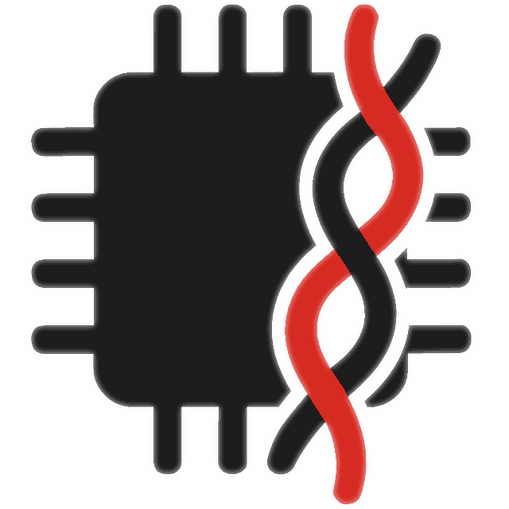

# WireWeaver

> WireWeaver is an API code generator for microcontrollers, supporting user-defined types, methods, properties, streams,
> and traits.
> It handles unsized types like Vec<T> and String even in no_std environments without an allocator,
> and ensures full backward and forward compatibility between devices across format versions.

Currently only Rust language is supported, with the idea to handle device communications in Rust and provide higher
level bindings for Python, C++ and other languages. C support is tentatively planned to be implemented directly, to run
e.g., on TMS320 DSPs.

Current state is - approaching alpha release.

## TLDR

Documentation with a step-by-step guide is
available [here](https://vhrdtech.github.io/wire_weaver/).

Supported:

* RPC - functions with any number of arguments of any type, returning any type
* Streams of bytes or objects
* Properties of any type
* Traits
* Blocking and async mode
* USB without drivers on Windows, Linux and macOS
* soon: WebSocket and UDP support
* soon: CAN bus support

Traits can be made "global" by publishing them on crates.io.
Useful for things like logging, GPIO control or firmware update, allowing code reuse across projects.

Wire format used (called shrink_wrap) is binary and designed to use bits and nibbles to make it compact without
compression.
See comparison to other formats in [examples/compare_wire_formats](./examples/compare_wire_formats).

## Quick start

Easiest way to start using WireWeaver is through one of the templates below, which contain firmware for several
development boards, API, client and Python bindings crates.

If you do not have physical hardware at hand, there is virtual device support.

### Microcontroller API over USB template

[WireWeaver template](https://github.com/vhrdtech/wire_weaver_template)

This is a minimal example showing an MCU firmware with USB, common no_std API crate, server on the MCU and client in
Rust and Python.

### Microcontroller API over Ethernet template

TODO

### Setup from scratch

See [Project setup]() page in the docs, which explains how setup projects in more detail for both std and no_std use.

### Low level wire format use

TODO

## Crate naming

`wire_weaver_` prefix is used on core crates that implement all the functionality.  
`ww_` prefix is used on crates using WireWeaver to provide standard library types and traits. Use it as well if you
think that your crate is useful across multiple projects.
