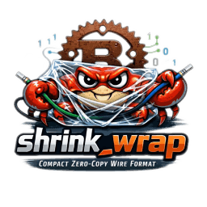

# WireWeaver

WireWeaver is a collection of crates for designing `#[no_std]` APIs:

- RPC, streams and properties
- API traits (composable building blocks)
- Backwards and forwards compatibility
- Server and client code generation, blocking and async
  - Currently for Rust and Python
- Cross platform USB, Ethernet and CAN Bus support
- Introspection and dynamic Python clients
- CLI and GUI tooling
- Uses `shrink_wrap` wire format
  - Zero-copy, no-alloc and no_std
  - Dynamically sized user-defined types and vectors (on no_std as well)
  - Bit level packing and [more](https://github.com/vhrdtech/wire_weaver/tree/master/shrink_wrap)

Current state is - approaching alpha release.

## TLDR

Documentation with a step-by-step guide is
available [here](https://vhrdtech.github.io/wire_weaver/).

Traits can be made "global" by publishing them on crates.io.
Useful for things like logging, GPIO control or firmware update, allowing code reuse across projects.

Wire format used (called shrink_wrap) is binary and designed to use bits and nibbles to make it compact without
compression.
See comparison to other formats in [examples/compare_wire_formats](./examples/compare_wire_formats).

## Standard library

Common data types and traits are located in the [ww_stdlib](https://github.com/vhrdtech/ww_stdlib) repository.
Notable ones are:

* `ww_date_time` - ISO 8601 date and time with optional time zone and nanoseconds, as small as 32 bits. Also NaiveDate
  and NaiveTime.
* `ww_version` - SemVer version (including pre and build strings).
* `ww_numeric` - Various numeric types, including offset-scale and subtypes.
* `ww_si` - SI units and derived values.
* `ww_gpio` - GPIO control data types and remote bridging API.
* `ww_can_bus` - CAN Bus types and bridging API.
* `ww_dfu` - Firmware update API.
* `ww_log_bare_metal` - Logging types and API for no_std bare metal targets.
* `ww_self` - Dynamic access to APIs (API model AST in shrink_wrap format).

## Quick start

Easiest way to start using WireWeaver is through one of the templates below, which contain firmware for several
development boards, API, client and Python bindings crates.

If you do not have physical hardware at hand, there is virtual device support.

### Microcontroller API over USB template

[WireWeaver template](https://github.com/vhrdtech/wire_weaver_template)

This is a minimal example showing an MCU firmware with USB, common no_std API crate, server on the MCU and client in
Rust and Python.

### Microcontroller API over Ethernet template

TODO

### Setup from scratch

See [Project setup]() page in the docs, which explains how setup projects in more detail for both std and no_std use.

### Low level wire format use

TODO

## Wire format

wire_weaver uses wire format called [shrink_wrap](https://github.com/romixlab/shrink_wrap) -
compact zero-copy wire format for microcontrollers using no allocator and supporting dynamic types.
If you only want to serialize and deserialize some data types, it can be used stand-alone.

## Crate naming

`wire_weaver_` prefix is used on core crates that implement all the functionality.  
`ww_` prefix is used on crates using WireWeaver to provide standard library types and traits. Use it as well if you
think that your crate is useful across multiple projects.
Standard library is in [ww_stdlib](https://github.com/vhrdtech/ww_stdlib) repository, contributions are welcome!
