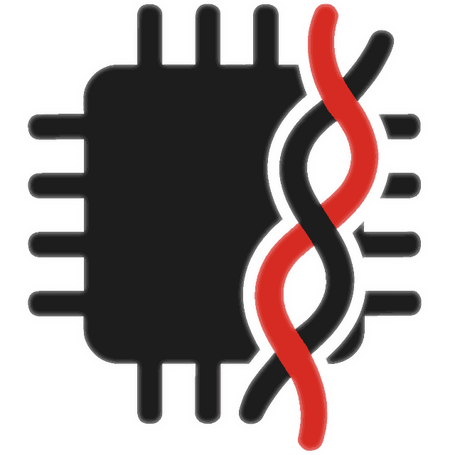

# WireWeaver { style="text-align:center" }

Collection of crates for designing **no_std** APIs with rich type system, **no allocation** and dense **bit-level** wire format.
{ style="text-align:center" }

{ width="250" style="display:block;margin:0 auto" }

Plus a whole set of standard types and traits, all written in Rust.
{ style="text-align:center" }

[Get started](user/quickstart.md){ .md-button .md-button--primary }
[Standard library](user/usage.md){ .md-button }
[Examples](user/usage.md){ .md-button }

---

## What it does

-   :simple-wire: __Wire Format__

    ---
    Dense zero-copy, no-alloc and no_std wire format. Dynamically sized user-defined types and vectors (on no_std as well).
    Bit level packing and [more](serdes/shrink_wrap.md).

-   :material-function: __RPC__

    ---
    Define and call methods with any number of arguments and return type.
    Call using blocking, async or promise interface.

-   :material-relation-one-to-zero-or-one: __Streams__

    ---
    Stream data of any type, observe property changes. Both to and from device.

-   :material-compare-vertical: __Evolution__

    ---
    Evolve data types and API while still allowing:

      - newer code to work with older devices
      - older code to work with newer devices

-   :material-usb: __USB, Ethernet, CAN and more__

    ---
    Host and device drivers. Plus a [framer](transport/ww_framer.md) that can put many small messages in one packet or a bigger message across multiple packets.

-   :material-tools: __Standard library__

    ---
    Numerical, SI, date & time, version and other [types](types.md).
    GPIO, I2C, CAN, UART, SPI, logging, firmware update and other [traits](std_library/overview.md).

-   :octicons-code-24: __Reference and Owned types__

    ---
    Automatically generate owned types for std usage from referenced ones.
    `&'i [u8]` becomes `Vec<u8>`, `MyType<'i>` `MyTypeOwned`, etc.

-   :fontawesome-solid-microchip: __First class MCU support__

    ---
    Geared towards bare-metal development with FLASH and RAM in mind.
    No allocation with full feature support.

-   :material-tools: __Tooling__

    ---
    CLI and GUI for debugging. Virtual devices. Introspection and tracing.
    Dynamic Python clients.

